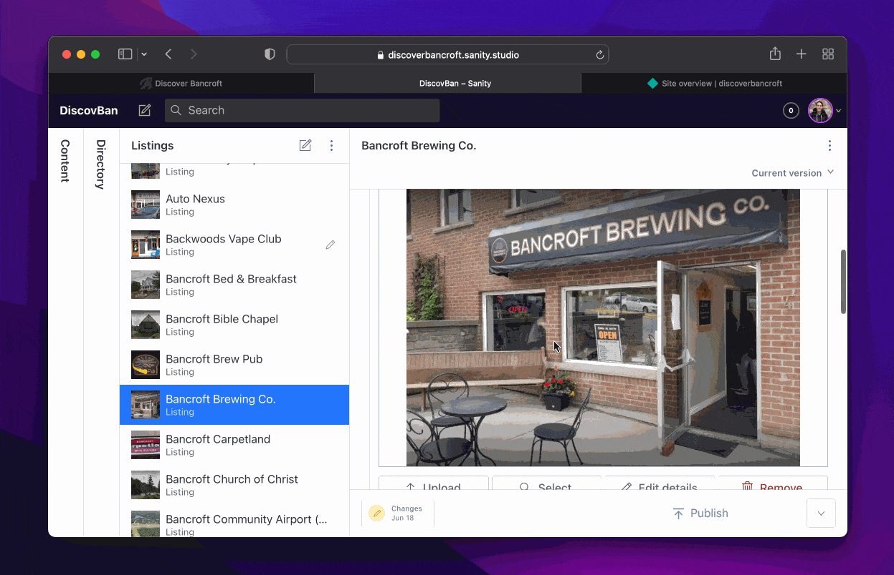
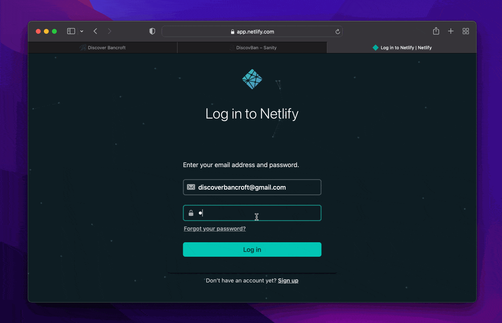

# Discover Bancroft

 
 
 
 
 
 
<a href="https://www.sanity.io/" target="_blank" rel="noreferrer">
<svg alt="sanity" width="40" height="40" viewBox="0 0 28 28" fill="none" xmlns="http://www.w3.org/2000/svg"><rect width="28" height="28" rx="3" fill="#F03E2F"></rect><path d="M8.62 7.25c0 2.41 1.52 3.84 4.54 4.6l3.21.73c2.87.64 4.61 2.25 4.61 4.87a4.91 4.91 0 01-1.07 3.15c0-2.61-1.37-4.02-4.69-4.87l-3.15-.7c-2.52-.57-4.47-1.89-4.47-4.73a4.89 4.89 0 011.02-3.05z" fill="#fff"></path><path d="M17.94 16.8c1.37.87 1.97 2.07 1.97 3.8-1.13 1.42-3.12 2.22-5.46 2.22-3.94 0-6.7-1.9-7.3-5.21h3.78c.48 1.52 1.77 2.22 3.5 2.22 2.1 0 3.49-1.1 3.52-3.03" fill="#F9B1AB"></path><path d="M10.59 10.82a3.99 3.99 0 01-1.97-3.57c1.1-1.4 3-2.27 5.32-2.27 4 0 6.33 2.08 6.9 5H17.2c-.4-1.15-1.4-2.05-3.23-2.05-1.96 0-3.3 1.12-3.37 2.9" fill="#F9B1AB"></path></svg>
 
</a>

---

[DiscoverBancroft.ca](https://www.discoverbancroft.ca/) is a simple directory website for the town of Bancroft, Ontario. 

The frontend is built with **React** and **Tailwind CSS** and is deployed using **Netlify**. 

The backend is a headless CMS setup with **Sanity.io**, allowing the client to edit website content and listings from a secure admin portal with a super clean UI.

## Demo

### Live website

### Sanity.io Headless CMS (backend)
Where the client is able to sign in and create, read, update and delete listings and other website content.

### Netlify deploys frontend

